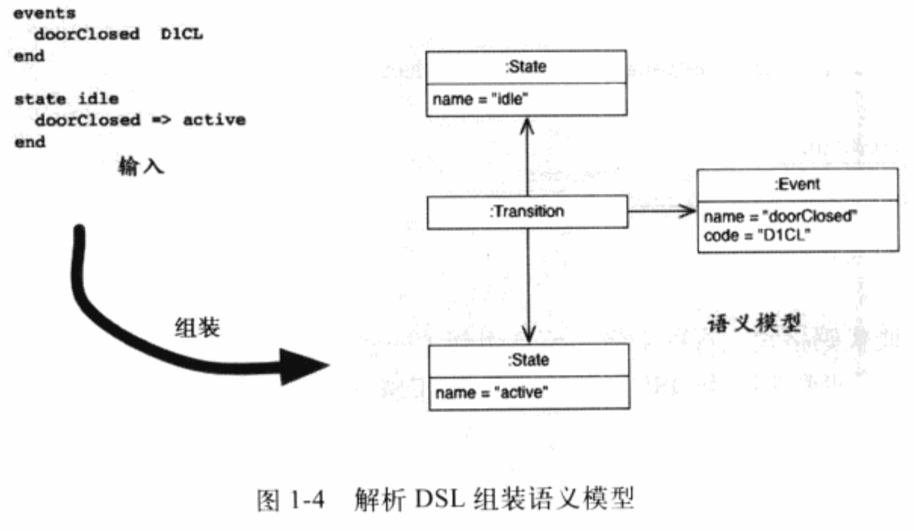
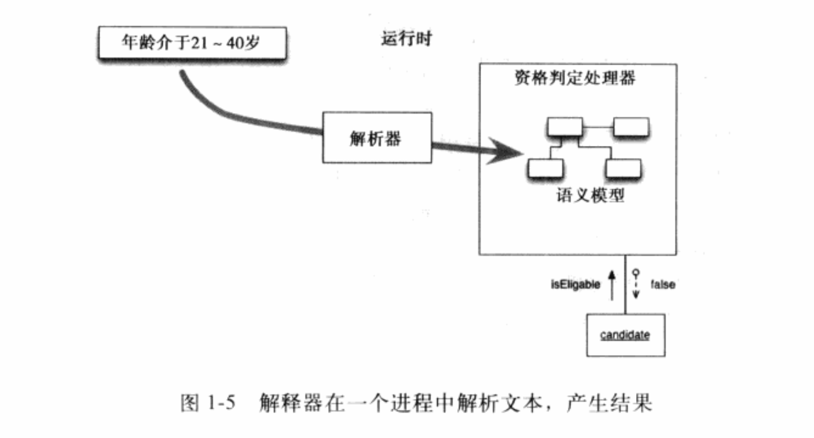
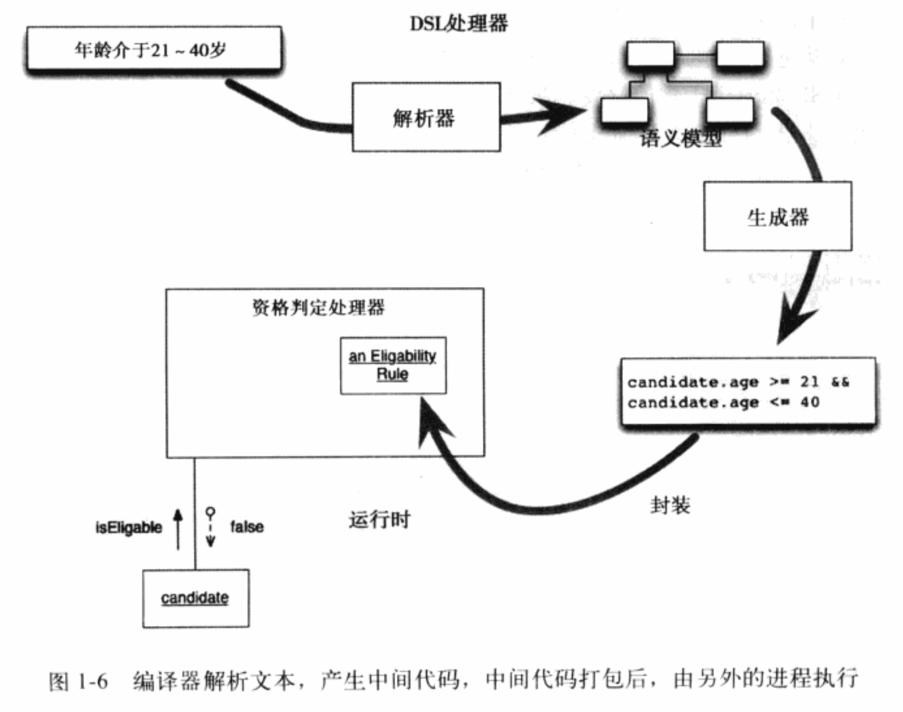

## 0 前言

### 0.1 为什么DSL很重要

   > 提升程序员的生产力

1）优势一：擅长在程序的某些特定地方发挥作用，并且让它们容易理解，进而提高编写、维护的速度，也会减少bug；
2）优势二：DSL往往短小易读，所以非程序员也能看懂这些驱动业务的代码，DSL表达业务，使得程序员和客户，或者和BA之间有非常顺畅的沟通。

## 1 叙述

### 1.1 入门例子

 > 是什么让内部DSL不同于通常的API呢？

内部DSL的另一个术语，连贯接口（fluent interface）。它强调，内部DSL实际上只是某种形式的API，只不过其设计考虑了连贯性难以琢磨的质量。

 > Domain Model & 语义模型 & 抽象语法树

以状态机模型为例：

留个问题，Domain Model & 语义模型 & 抽象语法树,这3者有何不同？

 * 同时也要注意：对于一个设计良好的DSL而言，语义模型至关重要。

 > 适应性模型

这里，DSL所带来的益处与状态机紧密相关，其所组成的某个特定模型就扮演了系统程序的角色。要改变状态机的行为，就需要修改模型中的对象及其相互关系。这种风格的模型通常称为“适应性模型”。

使用适应性模型是一种好的方式，DSL则简化了为这种模型编程的方式。有人把这种使用DSL的方式称为声明式编程。

 > 使用代码生成

在上面谈到处理DSL时，是组装“语义模型”，然后执行语义模型，这称之为解释。在软件圈子里，解释是个棘手的词语，然而我们希望这里严格限制为立即执行。

与解释相对的就是编译。在DSL的上下文里，编译方式通常指的是代码生成。

用状态机解释这个差异有点困难，因此换用另外一个例子。用某种规则判定人们是否符合某种资格，也许是为了满足保险资格。

如果是解释，资格判定处理器会解析规则，在执行时加载语义模型，也许是启动时加载。当检查某个候选人时，它会对这个候选人运行语义模型，获得一个结果。

如果是编译，解析器会加载语义模型，把它当作资格判定处理器构建过程的一部分。在构建期间，DSL处理器会产生一些代码，这些代码经过编译、打包，并且纳入资格判定处理器，也可能当作某种共享库。然后运行这段中间代码，对候选人进行评估。

解释型：

编译型：

总结时还是要突出下：

首先要有语义模型，它是DSL工作的核心。

### 1.2 使用DSL

### 1.3 实现DSL

### 1.4 实现内部DSL

### 1.5 实现外部DSL

### 1.6 内部DSL vs 外部DSL

### 1.7 其他计算模型概述

### 1.8 代码生成

### 1.9 语言工作台

## 2 通用主题

### 2.1 各种DSL

### 2.2 语义模型

### 2.3 符号表

### 2.4 语境变量

### 2.5 构造型生成器

### 2.6 宏

### 2.7 通知

## 3 外部DSL主题

### 3.1 分隔符指导翻译

### 3.2 语法指导翻译

### 3.3 BNF

### 3.4 基于正则表达式表的词法分析器

### 3.5 递归下降法语法解析器

### 3.6 解析器组合子

### 3.7 解析器生成器

### 3.8 树的构建

### 3.9 嵌入式语法翻译

### 3.10 内嵌解释器

### 3.11 外加代码

### 3.12 可变分词方式

### 3.13 嵌套的运算符表达式

### 3.14 以换行符作为分隔符

### 3.15 外部DSL拾遗

## 4 内部DSL主题

### 4.1 表达式生成器

### 4.2 函数序列

### 4.3 嵌套函数

### 4.4 方法级联

### 4.5 对象范围

### 4.6 闭包

### 4.7 嵌套闭包

### 4.8 列表的字面构造

### 4.9 Literal Map

### 4.10 动态接收

### 4.11 标注

### 4.12 解析树操作

### 4.13 类符号表

### 4.14 文本润色

### 4.15 为字面量提供扩展

## 5 其它计算模型

### 5.1 适应性模型

### 5.2 决策表

### 5.3 依赖网络

### 5.4 产生式规则系统

### 5.5 状态机

## 6 代码生成

### 6.1 基于转换器的代码生成

### 6.2 模板话的生成器

### 6.3 嵌入助手

### 6.4 基于模型的代码生成

### 6.5 无视模型的代码生成

### 6.6 代沟

