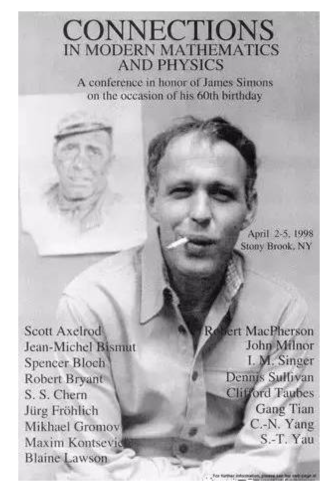
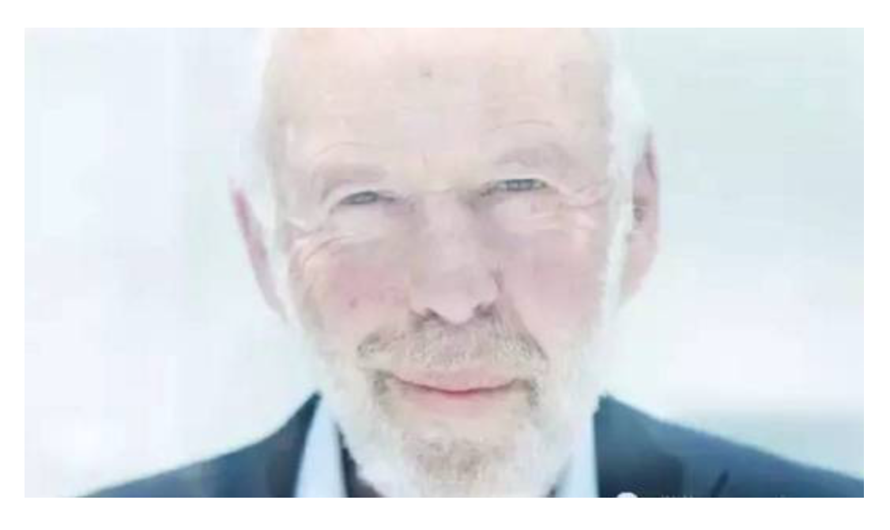

## 1 Simons简介

西蒙斯是个数学天才，20岁毕业于 MIT 数学系，23岁在 UC Berkeley 拿到 PhD，24岁去 Harvard 任教，26岁被国防分析研究所（IDA）请到 Princeton，表面上搞研究，实则为军方破解密码。后来因反对越战而离职，30岁在 Stony Brook 当上数学学院院长……

1998年，Simons 60 岁，纽约州立大学石溪分校的某个会议上展示 Simons 早期生活的海报。

37岁那年，西蒙斯获得了几何学界的诺贝尔奖：韦布伦奖（Oswald Veblen Prize）。

感觉差不多刷到头了，是时候换个行业，开启新一轮的人生。

于是西蒙斯成立了一家名叫“文艺复兴”（Renaissance Tech.）的对冲基金。从名字上看，这是要挑战文艺复兴时期那批通才的跨界难度。不幸的是，他又成功了。西蒙斯在基金界的地位，就好比武当张三丰，他在华尔街之外开创了一个新的投资流派。这么说吧，现在基金风格分为三种，分别叫：巴菲特、索罗斯、西蒙斯。

为了纪念当年的韦布伦奖，西蒙斯将旗舰产品命名为“大奖章基金”（Medallion Fund）。这个基金就像印钞机，二十多年来一直在赚钱，年均收益率大概是巴菲特的两倍。一般的基金收费按照“双二标准”，管理费2%，分成20%；但西蒙斯有钱任性，非得管理费5%，分成36%。即便如此，大奖章依然遭到疯抢，最后不得不停止对外发售，只受理自己人的钱。2008年金融危机爆发，基金界哀鸿遍野，但大奖章依然盈利了80%，而西蒙斯个人收入25亿美元。美国国会召开危机聆讯，第一个通知的就是他，要求当庭发誓没有乱来：

如图所示，那个打着红领带的老头。他的右侧是大家比较熟悉的 George Soros，左侧是 John Paulson 和 Philip Falcone ——这两位的基金后来也挂掉了。只有西蒙斯稳稳地赚到退休，并且在退休之后还装了个逼，大意是：我人都走了，基金还在那赚钱，这让我觉得自己并不重要，有点失落……

Simons 博士和他的妻子 Marilyn。Marilyn 是一位经济学家，也是他们基金会的主席

值得一提的是，西蒙斯先生跟中国颇有渊源。他有两位好友，分别闪耀在数学界和物理界，一位叫陈省身，一位叫杨振宁。

西蒙斯这辈子最大的成就，不是一年赚到数十亿美元，而是和陈省身合作的“陈-西蒙斯定理”——这后来成为微分拓扑学的基础性理论。就在西蒙斯前往 Stony Brook 掌舵数学的时候，杨振宁也正好去 Stony Brook 掌舵物理。当时杨振宁已经通过“宇称不守恒”拿到了诺贝尔奖，正试图建立一个更加强大的规范场理论，但在纤维丛等数学细节上遇到了困难。西蒙斯引入和乐群帮他扫清了数学障碍，从而建立了近代物理的基础——“杨-米尔斯理论”。这是一个相对论量级的成果，区区诺贝尔奖已不足以表彰其伟大。所以我们看到今天 Stony Brook 的物理学机构，名叫“杨振宁理论物理研究所”；而几何学机构，名叫“西蒙斯几何物理中心”。

因为陈省身出自清华数学系，而杨振宁出自清华物理系，所以在清华百年校庆之际，西蒙斯以福布斯土豪的身份跑来捐了一座楼。有意思的是，小楼冠以陈省身之名，然后供杨振宁住在里面。

## 2 Simons基金类型简介

## 3 Simons基金类型深入研究

