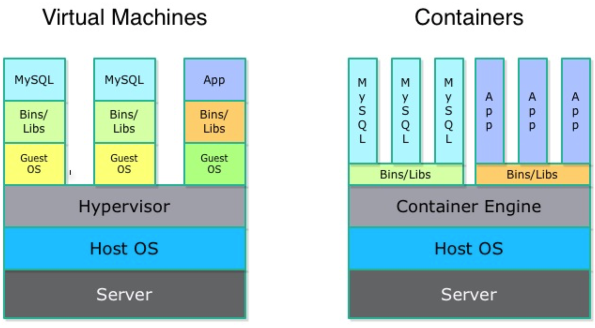
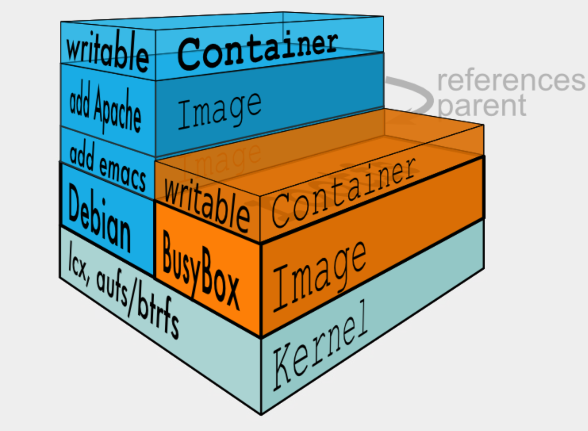
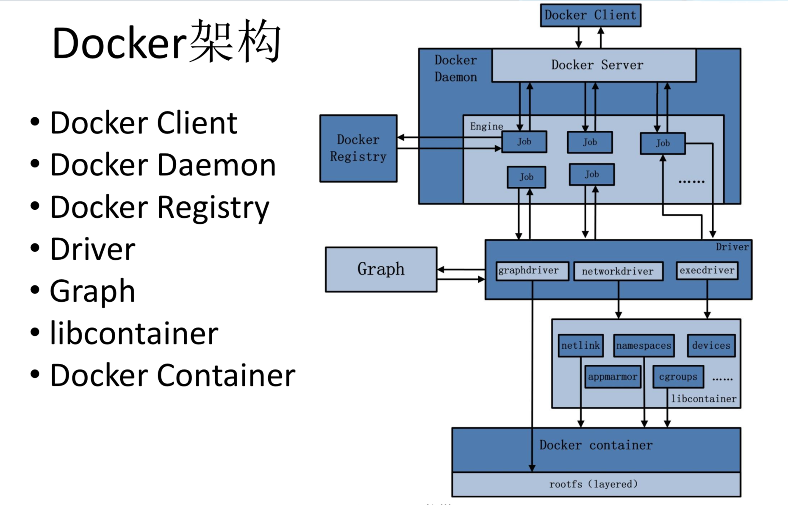

## 1 docker的前世今生

### 1.1 前世

 > docker

 > Container Engine

LXC/Libcontainer
Libcontainer provides a native Go implementation for creating containers with namespaces, cgroups, capabilities, and filesystem access controls. It allows you to manage the lifecycle of the container performing additional operations after the container
is created.

 > 组成

 * CGroups 限制资源
- [x] Cpu
- [x] Memory
- [x] Blkio
- [x] Freezer

 * Namespaces 隔离环境
- [x] MNT
- [x] PID
- [x] NET
- [x] IPC
- [x] USER
- [x] UTS

 > /var/lib/docker探底

 * aufs

 * graph

 * repositories-aufs

 > architecture

### 1.2 今生

## 2 docker使用

### 2.1 基本属性

### 2.2 实践

