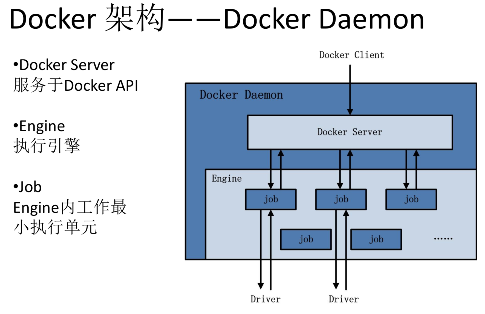
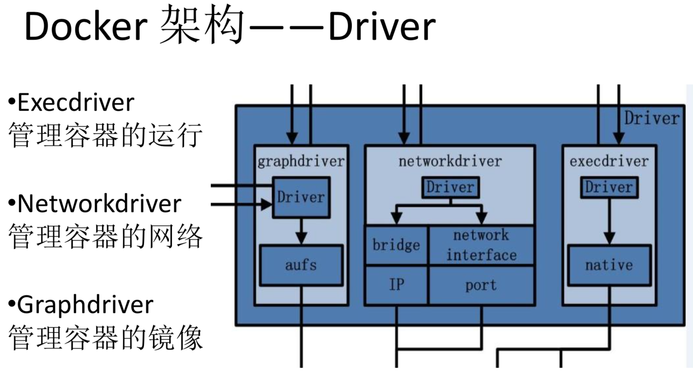
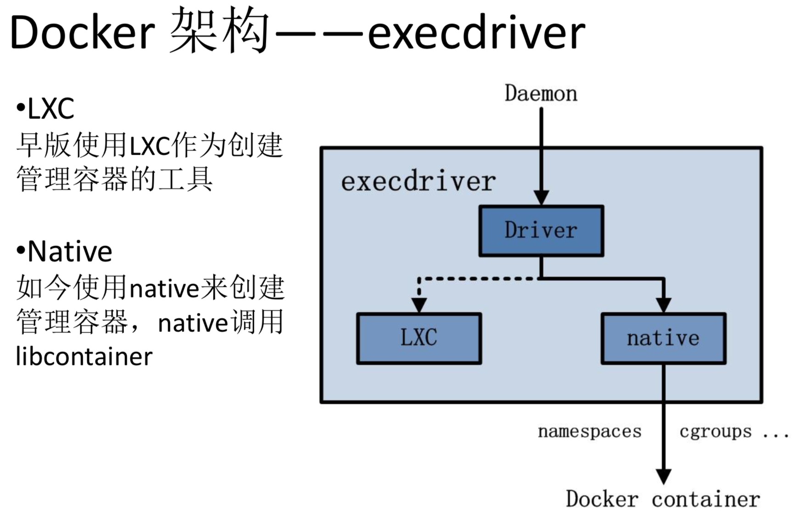
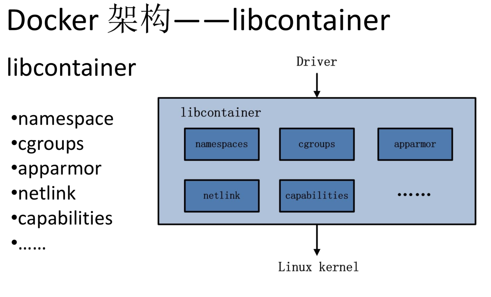
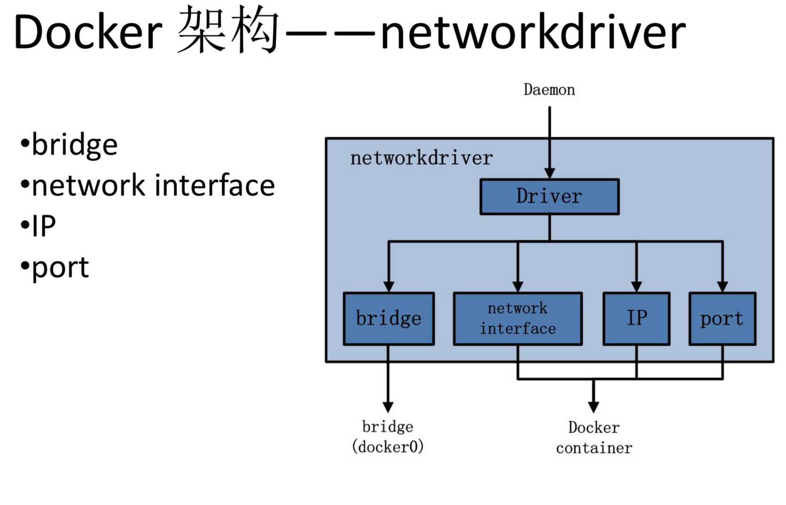
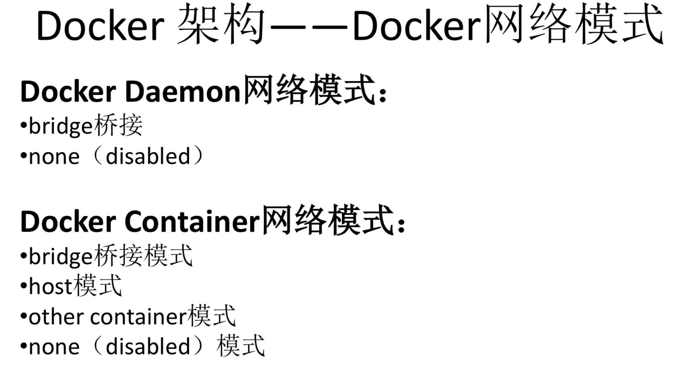
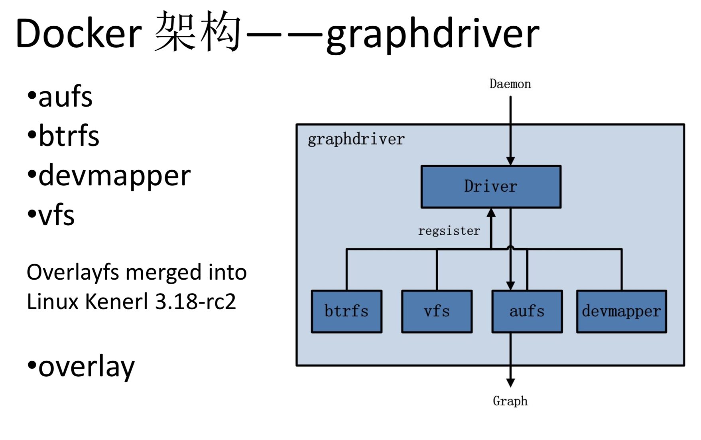
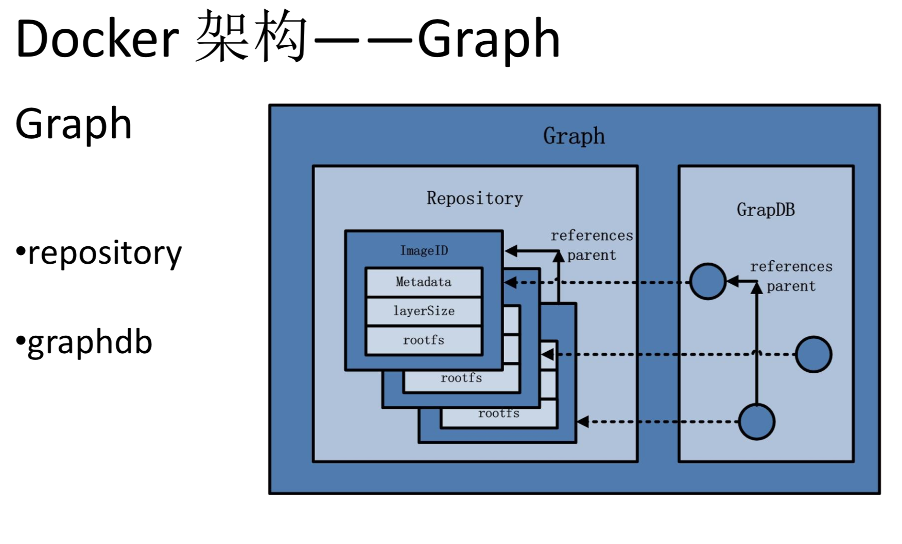
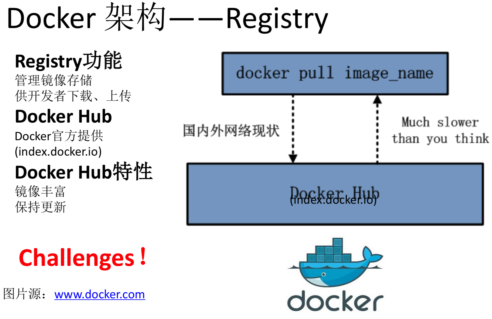

## 1 docker的前世今生


### 1.1 前世

 > docker


 > Container Engine

LXC/Libcontainer
Libcontainer provides a native Go implementation for creating containers with namespaces, cgroups, capabilities, and filesystem access controls. It allows you to manage the lifecycle of the container performing additional operations after the container
is created.

 > 组成


 * CGroups 限制资源
- [x] Cpu
- [x] Memory
- [x] Blkio
- [x] Freezer

 * Namespaces 隔离环境
- [x] MNT
- [x] PID
- [x] NET
- [x] IPC
- [x] USER
- [x] UTS


 > /var/lib/docker探底

 * aufs

 * graph

 * repositories-aufs


 > architecture


***



***



***



***



***



***



***



***



***




### 1.2 今生


## 2 docker使用


### 2.1 基本属性


### 2.2 实践


#### 2.2.1 本地部署Jenkins


## 3 docker深入解析

### 3.1 docker之操作系统

 > Docker之操作系统Alpine

Alpine 操作系统是一个面向安全的轻型 Linux 发行版。它不同于通常 Linux 发行版，Alpine 采用了 musl libc 和 busybox 以减小系统的体积和运行时资源消耗，但功能上比 busybox 又完善的多，因此得到开源社区越来越多的青睐。在保持瘦身的同时，Alpine 还提供了自己的包管理工具 apk，可以通过 https://pkgs.alpinelinux.org/packages 网站上查询包信息，也可以直接通过 apk 命令直接查询和安装各种软件。

Alpine 由非商业组织维护的，支持广泛场景的 Linux发行版，它特别为资深/重度Linux用户而优化，关注安全，性能和资源效能。Alpine 镜像可以适用于更多常用场景，并且是一个优秀的可以适用于生产的基础系统/环境。

Alpine Docker 镜像也继承了 Alpine Linux 发行版的这些优势。相比于其他 Docker 镜像，它的容量非常小，仅仅只有 5 MB 左右（对比 Ubuntu 系列镜像接近 200 MB），且拥有非常友好的包管理机制。官方镜像来自 docker-alpine 项目。

目前 Docker 官方已开始推荐使用 Alpine 替代之前的 Ubuntu 做为基础镜像环境。这样会带来多个好处。包括镜像下载速度加快，镜像安全性提高，主机之间的切换更方便，占用更少磁盘空间等。

下表是官方镜像的大小比较：

```python
REPOSITORY          TAG           IMAGE ID          VIRTUAL SIZE
alpine              latest        4e38e38c8ce0      4.799 MB
debian              latest        4d6ce913b130      84.98 MB
ubuntu              latest        b39b81afc8ca      188.3 MB
centos              latest        8efe422e6104      210 MB
```

 > 获取并使用官方镜像

由于镜像很小，下载时间往往很短，读者可以直接使用 docker run 指令直接运行一个 Alpine 容器，并指定运行的 Linux 指令，例如：

```python
$ docker run alpine echo '123'
123
```

 > 迁移至 Alpine 基础镜像

目前，大部分 Docker 官方镜像都已经支持 Alpine 作为基础镜像，可以很容易进行迁移。

例如：

ubuntu/debian -> alpine
python:2.7 -> python:2.7-alpine
ruby:2.3 -> ruby:2.3-alpine

另外，如果使用 Alpine 镜像替换 Ubuntu 基础镜像，安装软件包时需要用 apk 包管理器替换 apt 工具，如

```python
$ apk add --no-cache <package>
```

Alpine 中软件安装包的名字可能会与其他发行版有所不同，可以在 https://pkgs.alpinelinux.org/packages 网站搜索并确定安装包名称。如果需要的安装包不在主索引内，但是在测试或社区索引中。那么可以按照以下方法使用这些安装包。

```python
$ echo "http://dl-4.alpinelinux.org/alpine/edge/testing" >> /etc/apk/repositories
$ apk --update add --no-cache <package>
```

 > apk命令详解

/ # apk -h
apk-tools 2.10.0, compiled for x86_64.

Installing and removing packages:
  add       Add PACKAGEs to 'world' and install (or upgrade) them, while ensuring that all
            dependencies are met
  del       Remove PACKAGEs from 'world' and uninstall them

System maintenance:
  fix       Repair package or upgrade it without modifying main dependencies
  update    Update repository indexes from all remote repositories
  upgrade   Upgrade currently installed packages to match repositories
  cache     Download missing PACKAGEs to cache and/or delete unneeded files from cache

Querying information about packages:
  info      Give detailed information about PACKAGEs or repositories
  list      List packages by PATTERN and other criteria
  dot       Generate graphviz graphs
  policy    Show repository policy for packages

Repository maintenance:
  index     Create repository index file from FILEs
  fetch     Download PACKAGEs from global repositories to a local directory
  verify    Verify package integrity and signature
  manifest  Show checksums of package contents

Use apk <command> --help for command-specific help.
Use apk --help --verbose for a full command listing.

This apk has coffee making abilities.


 > 相关资源

Alpine 官网：http://alpinelinux.org/
Alpine 官方仓库：https://github.com/alpinelinux
Alpine 官方镜像：https://hub.docker.com/_/alpine/
Alpine 官方镜像仓库：https://github.com/gliderlabs/docker-alpine


