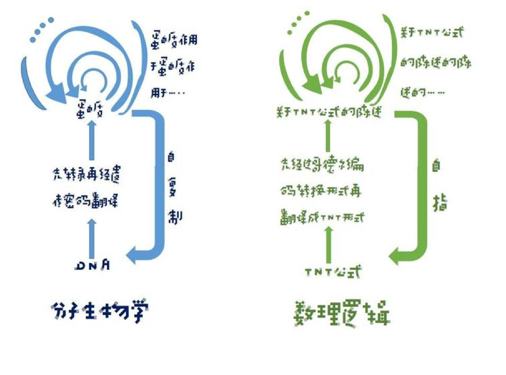
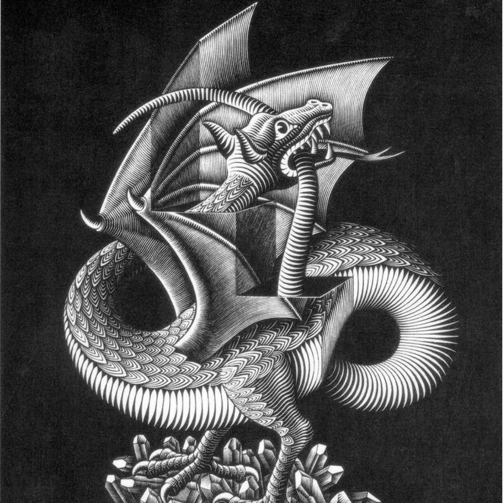
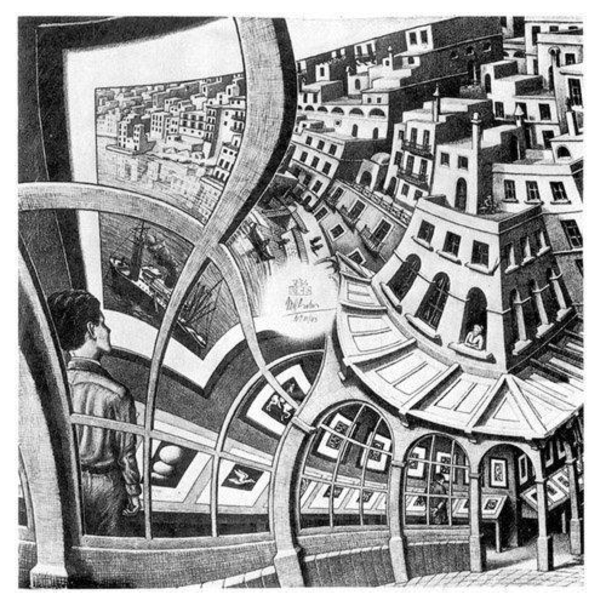
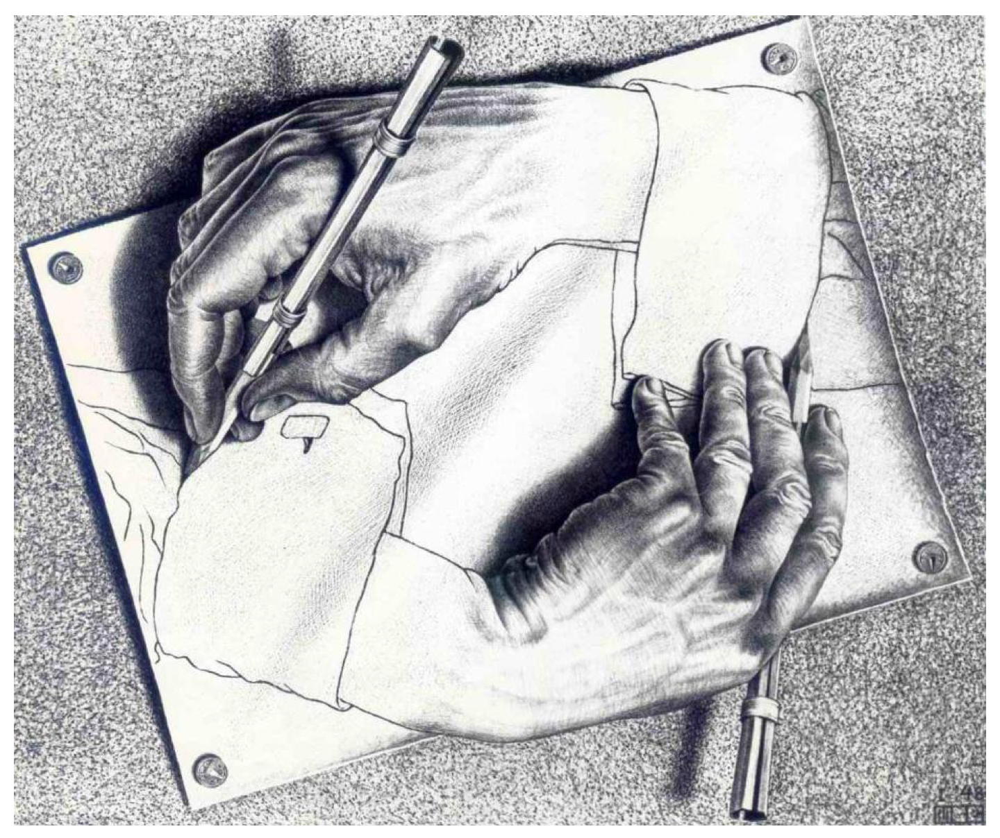
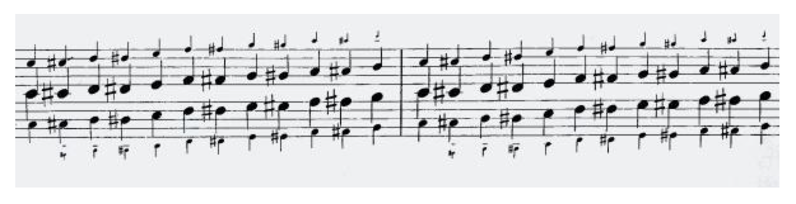
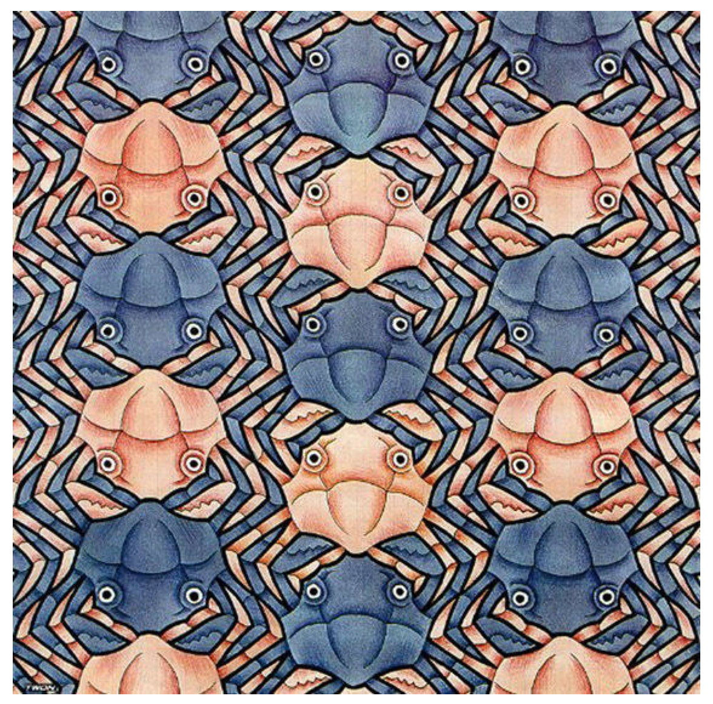

## 1 奇思妙想

### 1.1 做事所花费的时间总是比你预期的要长，即使你的预期中考虑了侯世达定律。

### 1.2 人类认知世界过程就是人类在各学科构造形式系统并在其中推演定理解释世界的过程！

### 1.3 自指和怪圈

### 1.4 大脑的结构

### 1.5 大脑的同构与形式系统的意义

### 1.6 一个同时存在于数理逻辑，分子生物学缠结层次系统

### 1.7 一个足够强有力的支撑系统 ，强到可以自我复制

### 1.8 跳出系统，超越自己也许是注定做不到的事情

### 1.9 不完全定理

### 1.10 画出来的说谎者悖论

### 1.11 音乐与怪圈

### 1.12 同构，螃蟹卡农

## 2 上篇GEB

### 2.0 导言 一首音乐 逻辑的奉献

***

#### 2.0.1 三部创意曲

### 2.1 第一章 WU谜题

#### 2.1.1 二部创意曲

### 2.2 第二章 数学中的意义与形式

#### 2.2.1 无伴奏阿基里斯奏鸣曲

### 2.3 第三章 图形与衬底

#### 2.3.1 对位藏头诗

### 2.4 第四章 一致性、完全性与几何学

#### 2.4.1 和声小迷宫

### 2.5 第五章 递归结构与递归过程

#### 2.5.1 音程增值的卡农

### 2.6 第六章 意义位于何处

#### 2.6.1 半音阶幻想曲，及互格

### 2.7 第七章 命题演算

#### 2.7.1 螃蟹卡农

### 2.8 第八章 印符数论

#### 2.8.1 一首无的奉献

### 2.9 第九章 无门与哥德尔

## 3 下篇EGB

### 3.0 前奏曲

### 3.1 第十章 描述的层次和计算机系统

#### 3.1.1 蚂蚁赋格

### 3.2 第十一章 大脑和思维

#### 3.2.1 英、法、德、中组曲

### 3.3 第十二章 心智和思维

#### 3.3.1 咏叹调及其种种变奏

### 3.4 第十三章 BlooP和FlooP和GlooP

#### 3.4.1 G弦上的咏叹调

### 3.5 第十四章 论TNT及有关系统中形式上不可判定的命题

#### 3.5.1 生日大合唱哇哇哇乌阿乌阿乌阿

### 3.6 第十五章 跳出系统

#### 3.6.1 一位烟民富于启发性的思想

### 3.7 第十六章 自指和自复制

#### 3.7.1 的确该赞美螃蟹

### 3.8 第十七章 丘奇、图灵、塔斯基及别的人

#### 3.8.1 施德鲁，人设计的玩具

### 3.9 第十八章 人工智能：回顾

#### 3.9.1 对实

### 3.10 第十九章 人工智能：展望

#### 3.10.1 树懒卡农

### 3.11 怪圈，或缠结的层次结构

#### 3.11.1 六部无插入赋格

