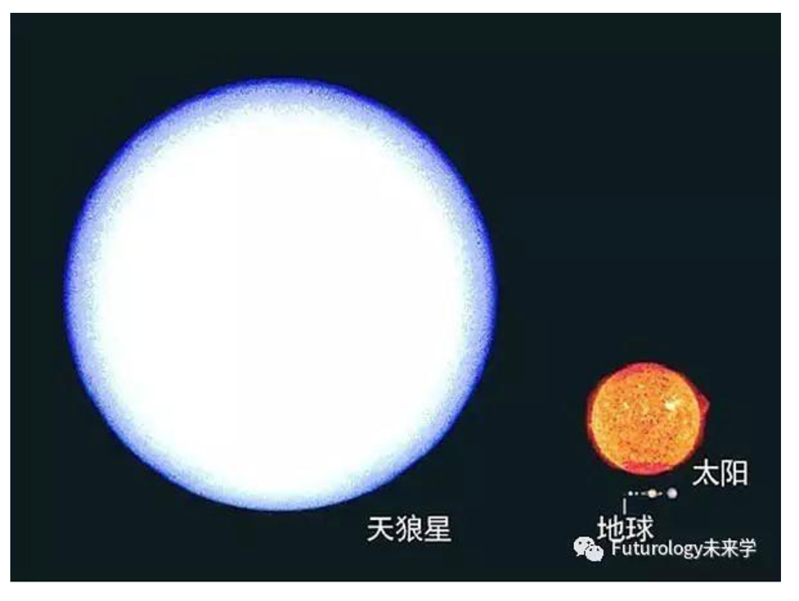

## 1 太阳系

### 1.1 地球

这就是我们的地球，真漂亮。我们地球的体积是10832.073亿立方公里。

### 1.2 带上月球小弟弟

这是地球和月球的对比。一个地球有49个月球那么大。

### 1.3 还有兄弟们

还是地球最漂亮。这样看的话，我们真要好好爱护她。

### 1.4 还有两个大家伙

好家伙，海王星有58个地球大，天王星有65个地球大。

### 1.5 还有更大的

### 1.6 太阳

## 2 离开太阳系

### 2.1 天狼星

### 2.2 北河三

### 2.3 大角星

### 2.4 参宿七

### 2.5 心大星

### 2.6 仙后座

### 2.7 天鹅座

### 2.8 大犬座

## 3 星系

### 3.1 银河系

我们所在的银河系，也叫Milky Way星系

### 3.2 lc1011

最左边最小的那是就是我们的银河系

那么Ic1011是最大了吗？

你必须看得更远一点

### 3.3 星系群

每一个亮点都是一个星系

### 3.4 星空

然而， 星系群也不过是星空中的一个角落。

##4 宇宙

我们的宇宙和其它宇宙有着不同的自然规律。

