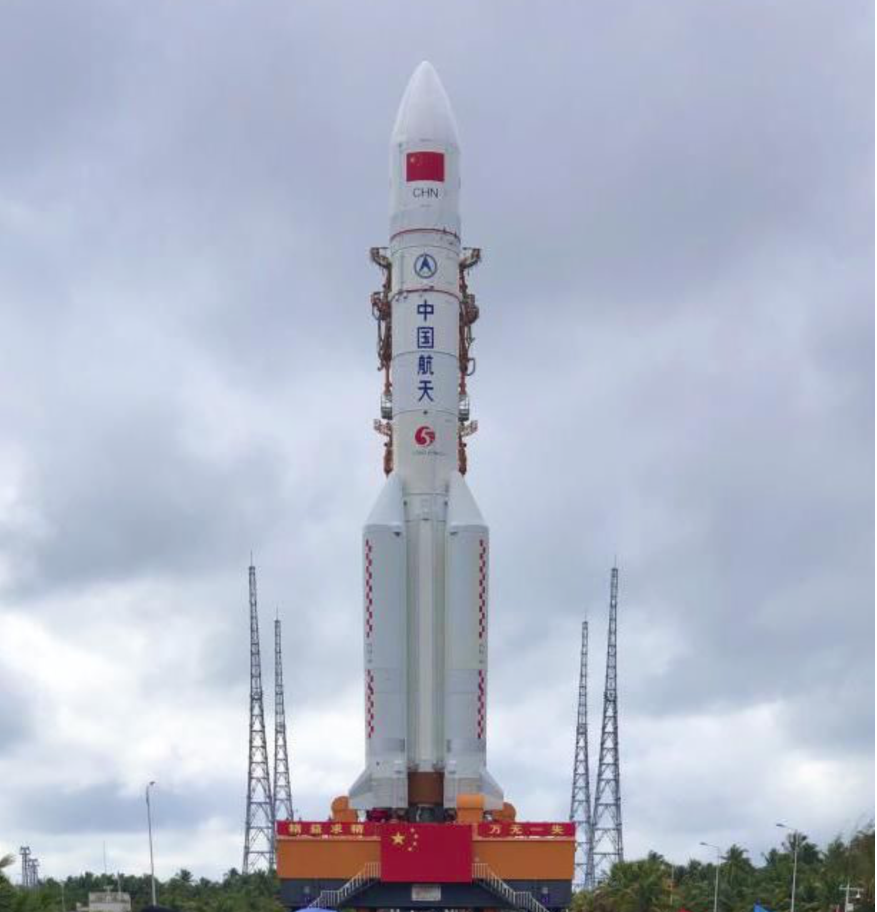
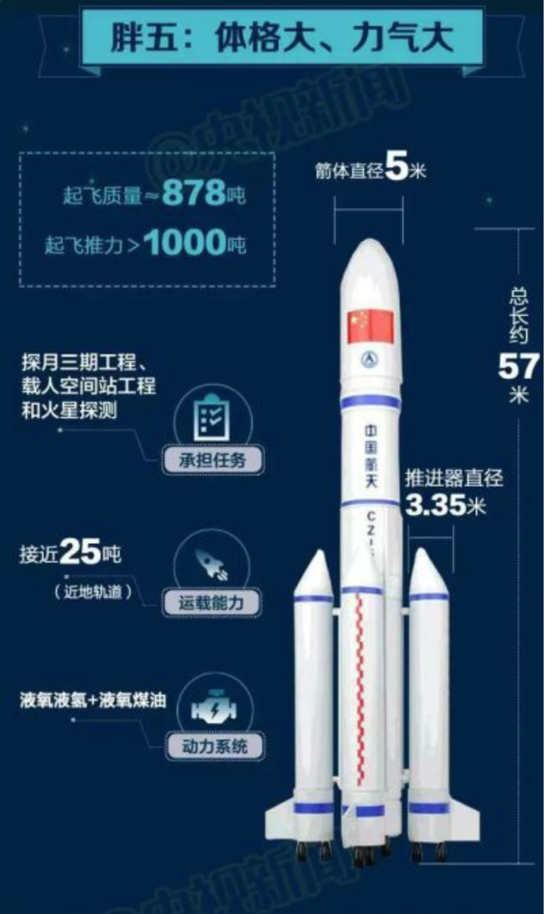
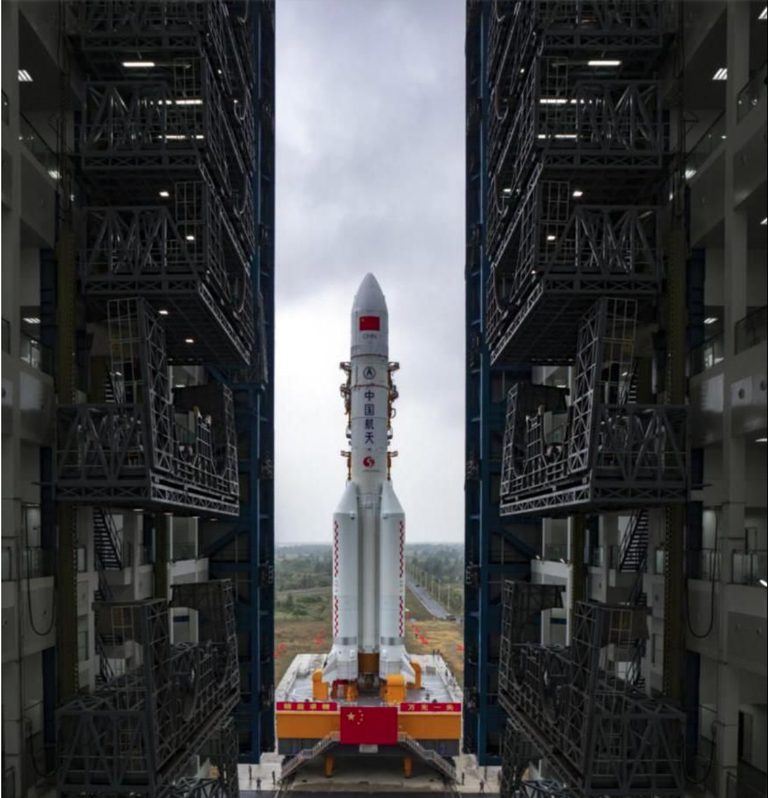
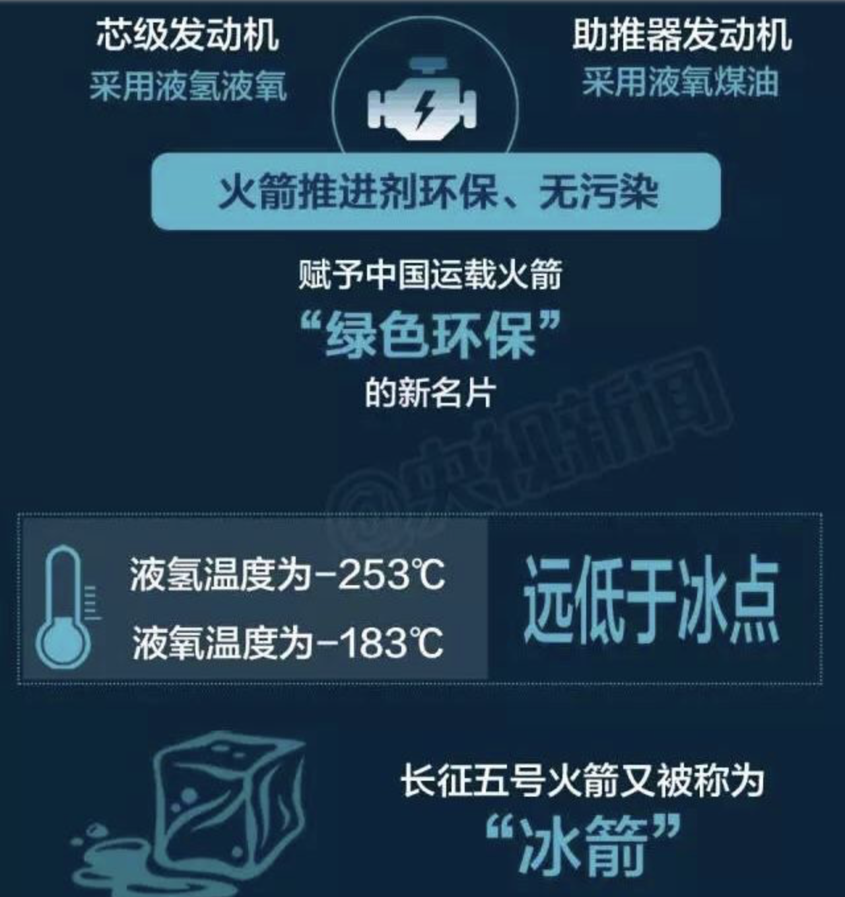

## 1 火箭-胖五的介绍

***

908天的等待之后，我国新一代大型运载火箭——长征五号迎来第三次发射任务。12月27日20时45分，中国文昌航天发射场，长征五号遥三火箭带着耀眼的光芒，撼天动地，冲破云霄。这次发射任务的成功，意味着我国具备了探索更远深空的能力，也为未来实现探月工程三期、首次火星探测任务等国家重大科技专项和重大工程奠定了重要基础，迈出了建设航天强国的坚实步伐。

　　遥三火箭有哪些特点？

　　200余项技术改进，代表我国运载火箭科技创新最高水平

　　作为我国首型5米芯级直径的大推力运载火箭，长征五号运载火箭因为体型宽大，被亲切地称为“胖五”火箭。

　　长征五号是我国首个自主研制的新一代大型运载火箭，创下了多个“第一”与“之最”，代表了我国运载火箭科技创新的最高水平。长征家族中，长征五号可谓是名符其实的“大火箭”——起飞质量最大、起飞推力最大、箭体结构最大、运载能力最强、运载效率最高。与国际同类现役运载火箭相比，长征五号近地轨道25吨左右的运载能力，已位居世界前列。长征五号还填补了我国大推力无毒无污染液体火箭发动机的空白，赋予中国运载火箭“绿色环保大推力”的新名片。

　　大国重器，十年“磨箭”。2016年11月3日，经过10余年的工程研制，长征五号火箭精彩亮相，首飞成功。然而，在2017年7月2日实施的第二次发射任务中，长征五号遥二火箭却因为发动机局部结构问题未能将卫星送入预定轨道。从第二次的发射失利到第三次的圆满成功，一共历时908天。在这30个月里，长五研制团队经历了什么？大火箭又作了哪些技术改进？

　　“归零”，成为记者采访过程中最常听到的词语。这是中国航天从实践中总结提出的解决质量问题的方法。中国航天科技集团一院长征五号火箭总指挥王珏告诉记者，“经过两年多的归零和验证工作，研制团队攻克了发动机技术难关。并且在完成发动机问题归零的同时，长五火箭的技术改进和可靠性提升工作也实现了突破。”

　　长征五号遥二火箭失利后，经过100余天的故障排查与定位以及180余天的试验验证，失利原因终于确认。火箭芯一级氢氧发动机在复杂力热环境下，局部结构发生异常，发动机推力瞬时大幅下降，致使发射任务失利。

　　“火箭上次失败，是一个复杂力热环境的相互共同作用下，使发动机的某一个零部件组件不能适应，出现失效。但这个毛病隐藏得比较深，偶尔出现，大多数情况下不出现，一旦出现就是灾难性的。所以这次归零，我们通过地面反反复复的各方面理论分析、试验验证，终于把‘捣蛋’的这个‘家伙’逮住了。” 中国航天科技集团一院长征系列火箭总设计师龙乐豪院士说。回忆起遥二发射失利后的场景，满头白发的龙乐豪说，当时并未与研制团队过多交流，“我相信他们有能力顶住压力。”

　　长五人确实顶住了压力，尽管攻关的过程并非一帆风顺。中国航天科技集团一院长征五号火箭总设计师李东对几个时间节点印象深刻。2018年11月30日，改进后的芯一级氢氧发动机在长程试车过程中出现问题，经过改进，2019年2月顺利通过了两次长程试车验证。然而到了2019年4月4日，在长征五号遥三火箭的总装工作进入到最后阶段时，一台用于后续任务的芯一级氢氧发动机又发现了问题……

　　面对一个又一个困难，科研人员没有灰心，会议室忘却寒暑、试验场不分昼夜。908天的夜以继日，集聚全国优势资源联合攻关，累计40余次15000余秒关键技术试验，终于攻破一个又一个难关。不只是发动机研制团队，各参研参试单位的科研人员、工程技术人员，联合攻关的院士专家，发射场系统的工作人员，甚至包括航天人的家属……都为长五遥三的成功付出了艰辛的努力。

　　据介绍，遥三火箭在遥二火箭的基础上，进行了200余项技术改进。其中比较重大的技术改进有9项，包括了发动机设计改进、长排整流罩设计改进、利用系统调节方案改进等。

　　大块头能做啥？

　　肩负月球采样返回、火星探测等重要任务

　　运载火箭的能力有多大，中国航天的舞台就有多大。作为目前我国运载能力最大的火箭，“胖五”是承载着中华民族对浩瀚宇宙向往的“梦想之箭”，也是我国由航天大国迈向航天强国的重要标志。长征五号肩负着月球采样返回、火星探测等多项重大航天工程任务，也可用于不同地球轨道大型载荷及其他深空探测任务载荷的发射。

　　再登月球——2020年，我国将用长征五号运载火箭择机发射“嫦娥五号”，实现月面无人采样返回，圆满完成探月工程三步走的规划目标。嫦娥五号任务需要将嫦娥五号探测器直接送入地月转移轨道，这必须由具有大运载能力的长征五号运载火箭来完成。

　　首探火星——目前，我国正在开展首次火星探测工程的研制工作。按照计划，2020年，我国将通过长征五号发射火星探测器，并通过一次发射实现火星环绕、着陆和巡视探测。李东介绍，长征五号的成功研制，将大幅度提高我国进入空间的能力，助力我国深空探测能力和水平的提升，实现在深空探测领域的跨越。

　　此外，长征五号火箭还为构筑我国新一代运载火箭系列型谱奠定了坚实技术基础。2020年，长征五号B等多型新一代运载火箭将相继迎来首飞。

　　火箭上“运”了啥？

　　搭载我国最重同步轨道卫星，全面验证“东方红五号卫星平台”关键技术

　　很多人还很好奇，长五遥三火箭发射，搭载的是什么卫星？

　　专家介绍，长征五号遥三火箭上的这名“乘客”，就是实践二十号卫星。它是以“东方红五号卫星平台”为基础研制的一颗新技术试验验证卫星，重量达8吨，是目前我国研制的地球同步轨道发射重量最重的卫星，也是技术含金量最高的一颗卫星。

   实践二十号携带了不少“黑科技”。它有着我国迄今为止面积最大、翼展最长、展开方式最复杂的太阳翼，能够低速转动，保证始终朝向太阳。它还配备了国内功率最大的电源控制器，确保太阳翼提供的超强电流“听话地”流到卫星每一个角落，维持卫星的健康运转。
   
   那么，这颗卫星到底有什么作用？

　　用中国航天科技集团公司五院总工程师、实践二十号卫星总指挥周志成院士的话来说，“实践二十号卫星首要任务是验证‘东方红五号卫星平台’的技术稳定性，由于搭载了十多项国际领先的技术验证载荷，也兼具新技术技术验证的使命。以‘实践’命名卫星，就是对该星所承担的探索意义的最好诠释。”

　　据介绍，“东方红五号卫星平台”是我国自主开发的新一代大型地球同步轨道卫星平台，单机国产化率达100%，能满足未来20年的大容量卫星应用需求。实践二十号作为该平台的首飞试验星，它的成功发射将对我国通信卫星事业的发展起到重要作用。
   
***

## 2 火箭的历史

## 3 火箭中的物理学知识

